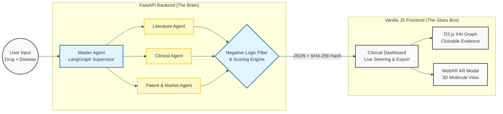

# 🧬 CuraNova AI
### **From Black Box to Glass Box: The World's First AR-Enabled, Blockchain-Audited Drug Repurposing Agent.**

    

---

## 🚨 The Problem: The "Trust Gap" in Pharma AI
Drug repurposing is the fastest way to bring treatments to market, but traditional AI tools fail to gain researcher trust due to three fatal flaws:
1. **"Black Box" Answers:** AI predicts a drug but can't explain *why*, leading to zero clinical trust.
2. **Business Blindness:** AI suggests drugs that are biologically sound but commercially unviable (e.g., highly toxic or under strict competitor patents).
3. **The Audit Void:** No immutable proof of discovery exists for FDA audits or IP filings.

## 💡 The Solution
**CuraNova AI** is an explainable, agentic decision-support platform. It utilizes a LangGraph-powered "Master Agent" to orchestrate specialized sub-agents (Literature, Clinical, Patent) to find, validate, and audit drug candidates in seconds.

---

## 🔥 "Unfair Advantages" (Key Differentiators)

* 🛑 **The "Negative Logic" Engine (Why Not? Panel):** Unlike standard AI that only looks for success, our system actively rejects candidates based on deterministic gates. The UI explicitly shows alternative drugs flagged for "High Toxicity" or "Active Competitor Patents."
* 👓 **3D Immersive Validation (AR):** Built with WebXR (`<model-viewer>`), researchers can launch a 3D AR view of the molecular protein structure directly from the dashboard to physically inspect molecular docking.
* 🎛️ **Human-in-the-Loop Live Steering:** Researchers can adjust the weight of Evidence (Literature vs. Trials vs. Patents) using live UI sliders. The overall confidence score recomputes instantly client-side without costly backend calls.
* 🛡️ **Immutable Audit Trail:** Every AI decision and confidence score is cryptographically hashed (SHA-256) upon generation, creating a "Proof of Discovery" timestamp for patent protection.
* 🔍 **100% Traceable "Glass Box" Graph:** An interactive D3.js Knowledge Graph where every edge click reveals the exact structured evidence (PubMed snippet, Trial ID) used to make the biological connection.

---

## 🏗️ System Architecture


🛠️ Enterprise-Grade Tech Stack
Backend (Intelligence Layer)
Framework: Python, FastAPI, Uvicorn
Orchestration: LangGraph (Multi-Agent Routing)
Validation: Pydantic (Request/Response schemas)
Data Ingestion: PubMed/NCBI Entrez APIs, ClinicalTrials.gov API v2, Local cached raw evidence.
Security/Audit: hashlib (SHA-256 IP Timestamping)

Frontend (Presentation Layer)
Architecture: Vanilla HTML5, CSS3, JavaScript (No heavy frameworks for maximum performance).
Typography & Icons: Inter font (Google Fonts), Font Awesome.
Data Visualization: D3.js (Interactive graph/XAI visualizations).
Immersive Tech: Google <model-viewer> for WebXR/AR integration.
Reporting: HTML report generation + jsPDF (UMD build) for clinician-style exportable documents.

🚀 Getting Started
Prerequisites
Python 3.10+
A modern web browser (Chrome/Edge/Safari)

1. Backend Setup
DOS
# Clone the repository
```
git clone [https://github.com/sanashk19/CuraNova-AI.git](https://github.com/sanashk19/CuraNova-AI.git)
cd CuraNova-AI/backend
```

# Create and activate virtual environment
```
python -m venv venv
venv\Scripts\activate  # Windows command
```

# Install dependencies
```
pip install -r requirements.txt

# Start the FastAPI server
uvicorn main:app --reload
```
The API will be live at http://localhost:8000

2. Frontend Setup
Because the frontend is built with pure Vanilla HTML/JS, you do not need Node.js or npm!
Open the frontend/ folder.
Use a local development server to avoid CORS issues. If you have VS Code, simply right-click index.html (or your main dashboard file) and select "Open with Live Server".
Alternatively, use Python's built-in server:
```
DOS
cd frontend
python -m http.server 3000
```
The UI will be accessible at http://localhost:3000

🧪 Core Workflow & Features
Drug + Disease Research Query: Enter a drug (e.g., Terazosin) and disease (ALS).
Modular Agent Analysis: Backend agents asynchronously scrape and parse literature, trials, and patent data.
Score & Reject: The Aggregator compiles an Overall Repurposing Score, actively catching bad candidates using the Toxicity/Patent gates.
Interactive Dashboard: View the result, see the rejected alternatives in the "Why Not?" panel, and use sliders to steer the AI's weighting.
Explore & Validate: Click the AI Knowledge Graph to read the source literature, or click "View in AR" to inspect the .glb protein model.
Export: Generate a structured, judge-ready clinical HTML/PDF report.

👥 The Team
CuraNova AI - Building Tomorrow’s Solutions for Today’s India.
Developed for EY Techathon 6.0.

# Sana Shaikh - Agentic AI & System Orchestration Lead
# Shriya Bhat - Data Engineer
# Prathiksha Gajula - Backend & API Engineer
# Jiya Haldankar - Frontend Engineer
